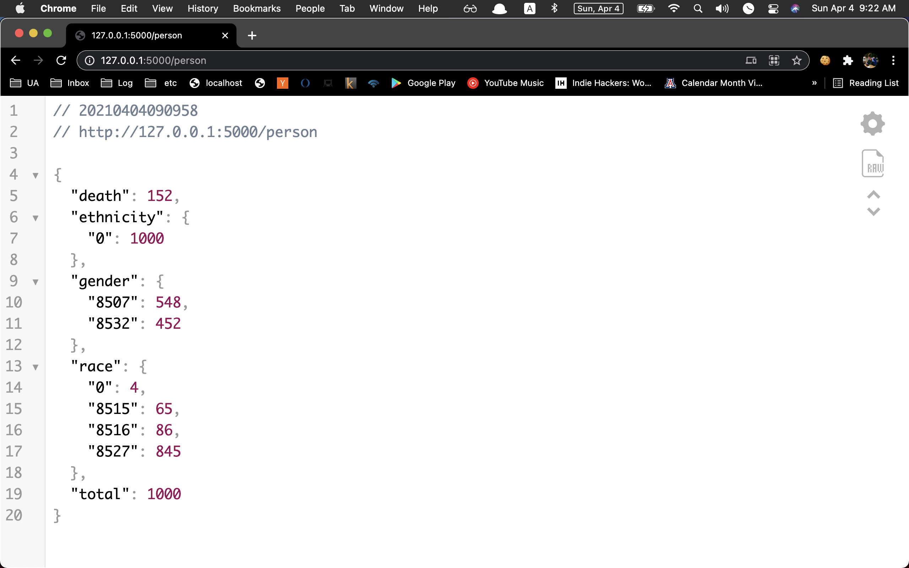
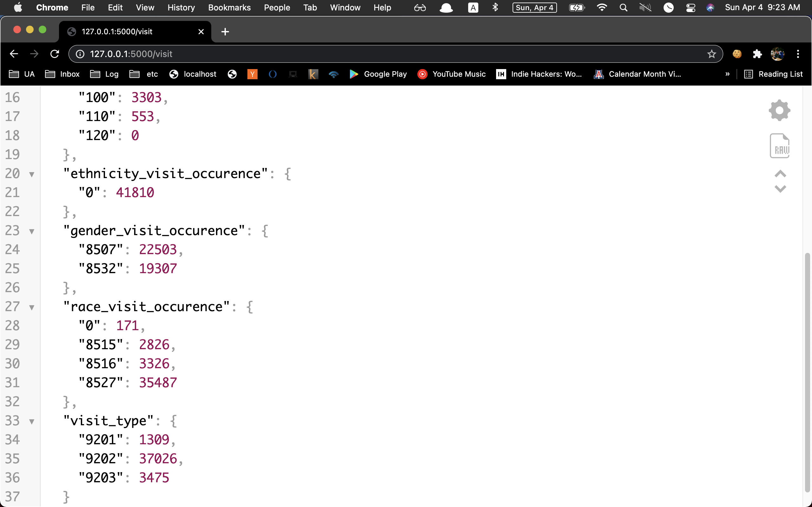

# EMR-API-flask

EMR API 제작

## Usage

라이브러리 설치:

    $ python -r requirements.txt

API 실행:

    $ python3 main.py --user USERNAME \
                    --password PASSWORD \
                    --database DB_NAME \
                    --host IP_ADDRESS

모든 옵션을 보기 위해서는 다음과 같이 입력:

    $ python3 main.py --help

출력되는 옵션은 아래와 같음:

    usage: main.py [-h] [--type TYPE] --user USER --password PASSWORD --host HOST
               [--port PORT] --database DATABASE

    optional arguments:
        -h, --help           show this help message and exit
        --type TYPE
        --user USER
        --password PASSWORD
        --host HOST
        --port PORT
        --database DATABASE

## Result

1. 환자 관련 통계.  👉🏼    http://127.0.0.1:5000/person
    - 전체 환자 수
    - 성별 환자 수
    - 인종별 환자 수
    - 민족별 환자 수
    - 사망 환자 수

2. 방문 관련 통계.  👉🏼    http://127.0.0.1:5000/visit
    - 방문 유형(입원/외래/응급)별 방문 수
    - 성별 방문 수
    - 인종별 방문 수
    - 민족별 방문 수
    - 방문시 연령대(10세 단위)별 방문 수

## Author

Sooyoung Moon / [@symoon94](https://www.facebook.com/msy0128) 
